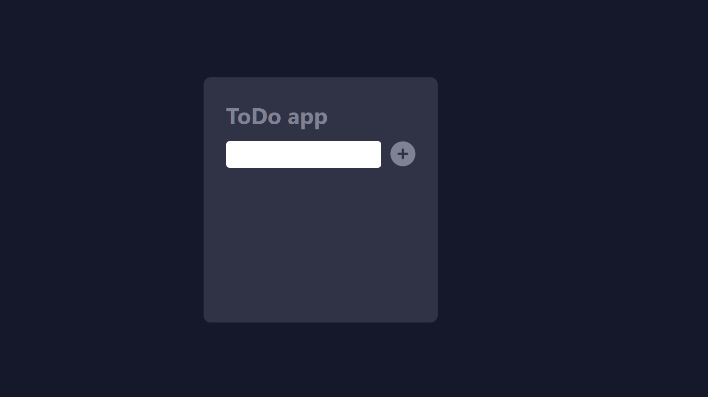

# Todo App
A simple Todo application built using ReactJS.

## Features
- Add items to the Todo list
- Delete items from the Todo list
- Responsive layout for all screen sizes

## Demo
[https://samhith37.netlify.app](https://demo.com)

## Screenshot

## Getting Started
These instructions will get you a copy of the project up and running on your local machine for development and testing purposes.

### Prerequisites
- Node.js
- npm

### Installation
1. Clone the repository
git clone https://github.com/samhithMR/todo-app.git

2. Install dependencies
npm install

3.Start the development server
npm start

## Built With
- ReactJS

